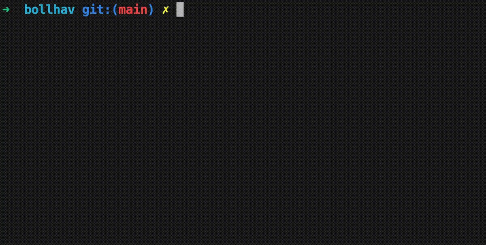

# bollhav

Model definition framework that standardizes code at pipe and model level using the model and pipe [abstractions](bollhav/docs/ABSTRACTIONS.md)

This library
- is permissive by design
- is designed with ✨developer experience✨ in mind

Concepts
- [Model](bollhav/docs/MODEL.md)
  - [Upstream](bollhav/docs/MODEL.md#upstream-dependencies)
- [Pipe](bollhav/docs/PIPE.md)
- [Tags](bollhav/docs/TAGS.md)
    - [examples](bollhav/docs/MATCHING.md)
- [Modes](bollhav/docs/MODES.md)
- [Progress Bar](bollhav/docs/PROGRESS_BAR.md)

Implementations:
- [Postgres](bollhav/docs/POSTGRES.md)
- [MSSQL](bollhav/docs/MSSQL.md)

# Demo



## Examples

A self-contained mock pipeline in [examples/](examples/) demonstrates the full bollhav pattern — models, pipes, tag matching, and write modes — without any database connections.

```bash
cd examples

# backfill mode
TAGS="[all]" USE_SCHEMA_SUFFIX=false BACKFILL_ENABLED=true \
  BACKFILL_SINCE=2024-01-01T00:00:00Z BACKFILL_UNTIL=2024-01-11T00:00:00Z \
  python main.py

# latest mode (resolves the most recent complete interval from the batch expression)
TAGS="[all]" USE_SCHEMA_SUFFIX=false LATEST_ENABLED=true \
  python main.py
```

See [examples/README.md](examples/README.md) for the full setup and available options

## Installation
```bash
pip install bollhav
```

## Testing
Tests use `pytest`. Run the full suite:
```bash
pytest tests/
```

## Build + publish example

```sh
git tag 1.2.3 && git push --tags
```
