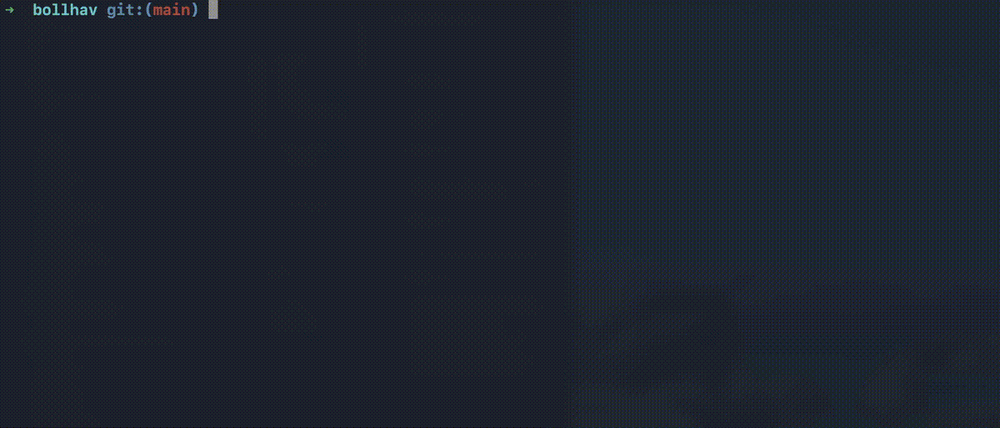

# bollhav

Model definition framework that standardizes data-pipeline code

This library
- is permissive by design
- is designed with ✨developer experience✨ in mind

Concepts
- [Model](docs/content/MODEL.md)
  - [Upstream](docs/content/MODEL.md#upstream-dependencies)
- [Runtime overrides](docs/content/RUNTIME_OVERRIDES.md) — env vars that override model settings at run time, plus the `@load_models` decorator
- [Tags](docs/content/TAGS.md)
    - [matching](docs/content/MATCHING.md)
- [Modes](docs/content/MODES.md)
- [Progress Bar](docs/content/PROGRESS_BAR.md)

Implementations:
- [Postgres](docs/content/POSTGRES.md)
- [MSSQL](docs/content/MSSQL.md)

# Demo



## Explore the features

See [examples/](examples/) for self-contained, runnable pipelines that isolate each feature of bollhav

## Installation
```bash
pip install bollhav
```

## TUI

bollhav ships a terminal UI for running and exploring your models — set the run
env (backfill window, suffixes, state mode, …) in a form and fire a dry run, a
dry-state run, or the real thing, all without remembering env-var names

Install it with the `tui` extra, then just run `bollhav` pointed at a folder
that contains your models:

```bash
pip install "bollhav[tui]"

bollhav                 # browse the current directory
bollhav path/to/models  # browse a specific folder
```

It discovers every `Model` defined below that folder and runs the nearest
`main.py`. See [bollhav/tui/README.md](bollhav/tui/README.md) for the full guide
(keybindings, config, the two modes).

## Testing
Tests use `pytest`. Run the full suite:
```bash
pytest tests/
```

## Build + publish example

```sh
git tag 1.2.3 && git push --tags
```
