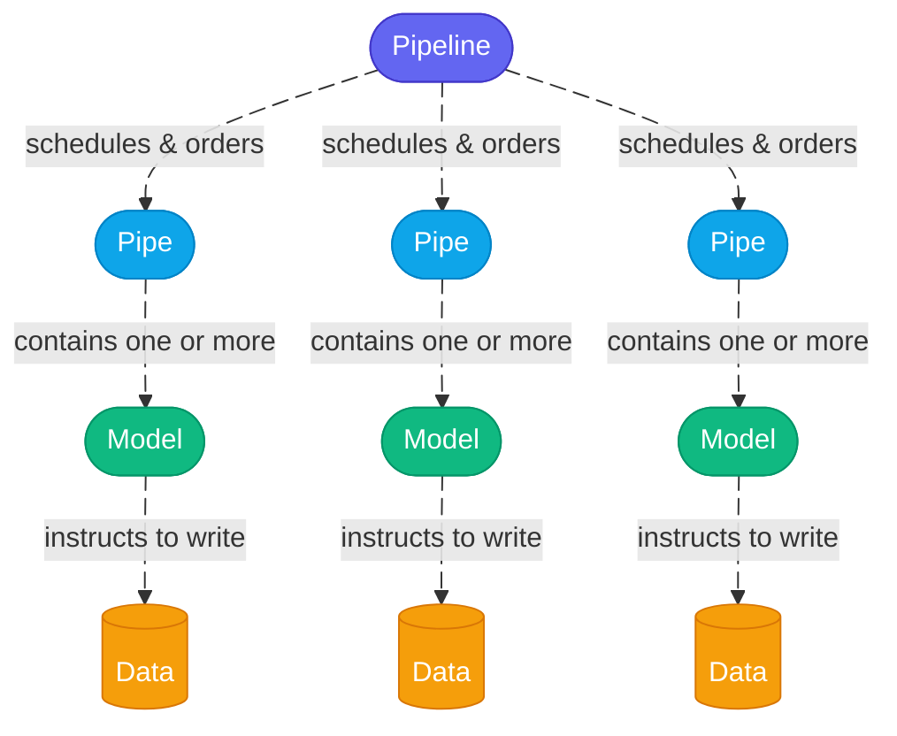

[back to README](..README.md)

## Levels of Abstraction

Naming levels of abstractions with well thought-out words means it becomes easier for humans **to reason about data engineering**.

### **Model level**
defines what data looks like — schema, columns, types, unique keys, and constraints. Keeping this separate means any pipe can reuse the same model definition without duplicating that logic.

### **Pipe level**
defines how and when a model runs — environment variables, cron schedules, backfill ranges, and schema suffixes. Separating this from the model means you can run the same model in different contexts (backfill, latest, dev, prod) without changing the model itself.

### **Pipeline level**
(*not in bollhav*) is the orchestrator level — it decides in what order and when pipes run, handling dependencies and scheduling across multiple pipes.
