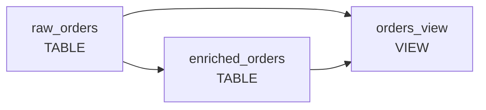
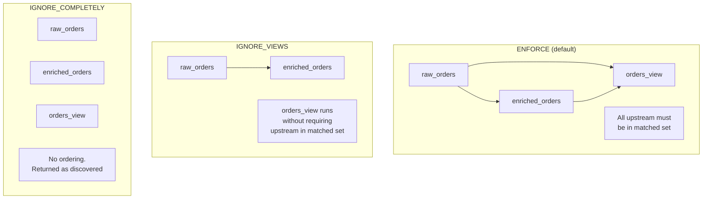

[back to README](../../README.md)

# Model

Standardizes code at the **model** level.

A `Model` is a pure data object describing what data looks like and where it goes. It does not contain execution logic — that lives in a separate `execute` function that receives the model as a parameter.

## Model creation example

```python
from bollhav.model.model import Model
from bollhav.model.target import Target
from bollhav.model.source_table import SourceTable
from bollhav.model.bounds import Bounds
from bollhav.model.batch import Batch
from bollhav.model.target_schema import TargetSchema
from bollhav.model.write_modes import WriteMode
from bollhav.postgres.columns import PostgresColumn, PostgresType
from bollhav.model.database import Database

model = Model(
    target=Target(
        name="orders",
        schema=TargetSchema(name="public"),
        database=Database.POSTGRES,
        columns=[
            PostgresColumn(name="id", data_type=PostgresType.BIGINT, primary_key=True, nullable=False),
            PostgresColumn(name="created_at", data_type=PostgresType.TIMESTAMPTZ, nullable=False, partition_on=True),
            PostgresColumn(name="email", data_type=PostgresType.TEXT, nullable=True, sensitive=True),
        ],
        write_mode=WriteMode.APPEND,
    ),
    source=SourceTable(name="raw.orders"),
    bounds=Bounds(begin=datetime(2024, 1, 1, tzinfo=timezone.utc)),
    batching=Batch(interval_expression="0 * * * *"),
    debug=True,
)
```

### Model parameters

| Parameter | Type | Default | Description |
|---|---|---|---|
| `target` | `Target` | required | Defines where and how data is written |
| `source` | `SourceTable` | `None` | Defines where data is read from |
| `bounds` | `Bounds` | `None` | Optional backfill begin/end bounds |
| `batching` | `Batch` | `None` | Controls batch size and retries |
| `tagging` | `Tags` | `None` | Controls tag auto-assembly |
| `enabled` | `bool` | `True` | Whether the model is active |
| `debug` | `bool` | `False` | Pretty-prints the model at construction time |
| `description` | `str` | `None` | Human-readable description |
| `upstream` | `list[str]` | `None` | Names of models that must run before this one |
| `**kwargs` | | | Extra metadata. Callable values are resolved with non-callable kwargs as arguments |

### Target parameters

| Parameter | Type | Default | Description |
|---|---|---|---|
| `name` | `str` | required | Destination table name |
| `schema` | `TargetSchema` | `TargetSchema()` | Destination schema |
| `database` | `Database` | `None` | Target database. Required if `columns` is set |
| `columns` | `list[PostgresColumn]` | `[]` | Column definitions. Required if `database` is set |
| `model_type` | `ModelType` | `TABLE` | `TABLE` or `VIEW` |
| `write_mode` | `WriteMode` | `APPEND` | How to write data |
| `dsn_env_var` | `str` | `None` | DSN env var for the target connection |

`Target.partitioned_by` is a derived `@property` — set `partition_on=True` on the column you want to partition by; only one column may carry it.

### SourceTable parameters

| Parameter | Type | Default | Description |
|---|---|---|---|
| `name` | `str` | required | SourceTable table or entity name |
| `schema` | `str` | `None` | SourceTable schema |
| `dsn_env_var` | `str` | `None` | DSN env var for the source connection |
| `query` | `str` | `None` | Optional query override |
| `infer_schema_length` | `int` | `None` | Passed to polars as `infer_schema_length`. Max rows to scan for schema inference. `None` scans all rows (can be slow) |

### Bounds parameters

| Parameter | Type | Default | Description |
|---|---|---|---|
| `begin` | `datetime` | `None` | Backfill start — must be UTC-aware |
| `end` | `datetime` | `None` | Backfill end — must be UTC-aware |

### Batch parameters

| Parameter | Type | Default | Description |
|---|---|---|---|
| `interval_expression` | `IntervalExpression` | `"@daily"` | Chunk size — how an interval is split into `TZInterval`s for processing |
| `window_expression` | `IntervalExpression \| None` | `None` | Scope for `latest` mode — "one of what" counts as the latest complete unit. When `None`, falls back to `interval_expression` (one chunk = one scope, pre-window behaviour). Ignored in reload/backfill, which use explicit since/until |
| `tz` | `tzinfo` | `timezone.utc` | Timezone used for interval resolution |
| `lookback` | `int` | `None` | Extends interval start backwards by N cron-ticks **of the interval_expression**. Units are ticks, not calendar days/hours — e.g. with `interval_expression="*/15 * * * *"`, `lookback=5` is 75 minutes, not 5 days. See [RUNTIME_OVERRIDES.md](RUNTIME_OVERRIDES.md#lookback) |
| `retries` | `int` | `None` | Retry count on failure |

#### `interval_expression` vs `window_expression`

Two cron expressions that do different jobs:

- **`window_expression`** — the OUTER scope ("catch up on one full DAY")
- **`interval_expression`** — the INNER chunks ("split that into 15-min WRITES")

`window_expression` is consulted only in `latest` mode. For `reload`/`backfill` the since/until are explicit and the window is irrelevant.

```
assume now = 2024-06-15 14:35 UTC

window="@daily", batch="*/15 * * * *"  → 96 × 15-min chunks covering yesterday
window="@daily", batch="@hourly"       → 24 × hourly chunks covering yesterday
window unset (== batch), batch="@hourly" → 1 × hourly chunk (13:00→14:00)
```

```python
batching=Batch(
    interval_expression="*/15 * * * *",   # chunk into 15-min pieces
    window_expression="@daily",         # scope = one full day
)
```

When `LATEST_ENABLED=True`, `infer_intervals()` returns 96 `TZInterval`s covering yesterday 00:00 → today 00:00.

### Model methods

#### `infer_intervals() -> list[TZInterval] | list[None]`

Resolves and chunks a time interval into `TZInterval`s. Reads `batching` (for expression, tz, lookback, mode) and `directives` (for `latest`, `reload`, `since`, `until`) directly — both are populated by `apply_runtime_overrides` before you call this. Returns `[None]` when `model.batching is None`, signalling that the model runs once with no interval filter.

Three modes, evaluated in order: **latest** (if `model.directives.latest`), **reload** (if `model.directives.reload`), **backfill** (default). See the `infer_intervals` docstring for full details.

#### `latest_complete_interval(interval_expression_override=None, tz_override=None) -> TZInterval`

Returns the most recent fully elapsed interval. An in-progress interval is never returned.

| Parameter | Type | Default | Description |
|---|---|---|---|
| `interval_expression_override` | `IntervalExpression \| None` | `None` | Overrides the model's interval expression |
| `tz_override` | `tzinfo \| None` | `None` | Overrides the model's timezone |

### Computed attributes

| Attribute | Description |
|---|---|
| `target.sensitive` | `True` if any column has `sensitive=True` |
| `target.unique_columns` | Columns with `unique=True` — required for `UPSERT_NO_DELETE` |
| `target.partitioned_by_index` | `True` if `partitioned_by` is set |
| `tags` | Auto-assembled from `name`, `target.schema.name`, and `"all"` |

## Upstream dependencies

Models can declare dependencies on other models using the `upstream` parameter. When `apply_runtime_overrides` (or `match_models` directly) returns results, they are topologically sorted so that upstream models always appear before their dependents.

```python
raw_orders = Model(
    target=Target(name="raw_orders"),
)

enriched_orders = Model(
    target=Target(name="enriched_orders"),
    upstream=["raw_orders"],
)
```

If a matched model depends on an upstream model that is not in the matched set, matching raises a `ValueError`. This ensures you never accidentally run a model without its dependencies.

Circular dependencies are also detected and raise a `ValueError`.

### Upstream mode

The `upstream_mode` parameter controls how upstream dependencies are enforced. It can be set via the `UPSTREAM` environment variable (read by `@load_models`) or passed directly to `match_models` / `apply_runtime_overrides`.

| Mode | Value | Description |
|---|---|---|
| `ENFORCE` | `enforce` | All upstream dependencies must be present and are ordered (default) |
| `IGNORE_VIEWS` | `ignore_views` | Views skip upstream checks; tables are still enforced |
| `IGNORE_COMPLETELY` | `ignore_completely` | No ordering or validation, models returned as-is |

```bash
export UPSTREAM=ignore_views
```

```python
from bollhav.model import match_models, UpstreamMode

match_models(folder="src/models", tags="[all]", upstream_mode=UpstreamMode.IGNORE_VIEWS)
# or, more commonly, just `@load_models` and let it read UPSTREAM from env.
```

Given these models:



Each mode behaves differently:



## Debug

When `debug=True`, the model is pretty-printed at construction time. You can also call it manually at any point:

```python
model.pretty()
```

## Write modes

Read more [here](MODES.md)

```python
from bollhav.model.write_modes import WriteMode

WriteMode.APPEND
WriteMode.RECREATE_PARTITION     # requires partitioned_by
WriteMode.UPSERT_NO_DELETE       # requires at least one column with unique=True
WriteMode.VIEW                   # requires ModelType.VIEW
```

For full-reload semantics, combine a write mode with `Target(recreate_table=True)` or `Target(truncate_table=True)` — these run once before the chunked write loop (see [MODES.md](MODES.md#pre-load-flags-recreate_table-and-truncate_table)).

## Tag filtering

Tags are automatically assembled at init time. By default `name`, `schema`, and `"all"` are added.

```python
model = Model(target=Target(name="orders", schema=TargetSchema(name="public")))
model.tags  # {"orders", "public", "all"}
```

Control which tags are auto-added via `Tags`:

```python
from bollhav.model.tags import Tags

Model(..., tagging=Tags(name_add_to_tags=False, schema_add_to_tags=False, model_gets_all_tag=False))
```