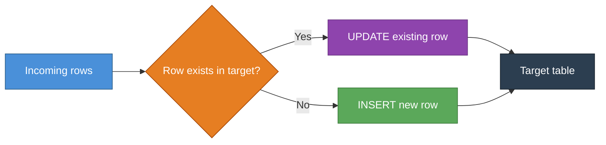
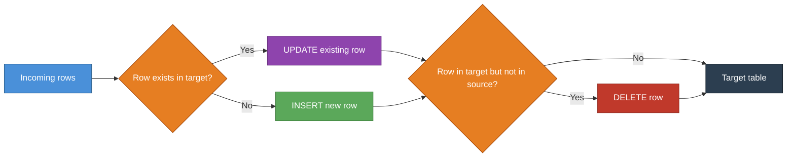
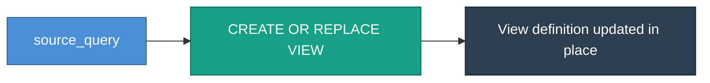

[back to README](..README.md)

# Write modes

Describes how data is written to the target table or view. This is just a naming convention, you can use the implementations in this library, or build your own for your own needs.

## APPEND

Simply appends incoming rows to the target. No deduplication, no deletes.

### When to use:
- When the resulting size does not matter
- We want to save rows immediately (as to not break our pipeline, like in raw)
- Duplicates are okay

## RECREATE_INSERT

Drops and recreates the table before inserting. Stronger than TRUNCATE_INSERT as it also resets the schema.

### When to use:
- When the table schema may have changed and needs to be realigned with the model
- When a full schema reset is preferred over a simple truncate

## TRUNCATE_INSERT

Fully reloads the table on every run. Wipes everything first, then inserts.

### When to use:
- When the dataset is quite small, so reloading it completely is fine
- When we want to make sure that deletes from source are included

## UPDATE_INSERT

Updates rows that already exist, inserts rows that don't. Never deletes.

### When to use:
- This is much like a MERGE statement, where deduplication is handled.
- Duplicates are not okay
- When we want to make sure that deletes from source are _NOT_ handled
- This relies on a unique key constraint
- NOT IDEMPOTENT

## OVERWRITE_INSERT

Deletes matching rows first, then inserts all incoming rows fresh. Effectively a targeted replace.

### When to use:
- This is much like a MERGE statement, where deduplication is handled.
- Duplicates are not okay
- When we want to make sure that deletes from source _ARE_ handled
- IDEMPOTENT

---

## MERGE

Full sync — updates existing, inserts new, and deletes rows that are no longer in the source. Requires Postgres 15+.

### When to use:
- Wait until postgres 15

## VIEW

Does not write data. Creates or replaces a view definition in place.

### When to use:
- Simple renaming of columns
- Useful for segregating data
- Does not persist data, which means the result is calculated on each use

## Summary

| Mode | Inserts | Updates | Deletes | Notes |
|---|---|---|---|---|
| `APPEND` | ✅ | ❌ | ❌ | No deduplication |
| `TRUNCATE_INSERT` | ✅ | ❌ | ✅ | Full reload every run |
| `UPDATE_INSERT` | ✅ | ✅ | ❌ | Safe upsert |
| `OVERWRITE_INSERT` | ✅ | ✅ | ✅ | Deletes matches first |
| `MERGE` | ✅ | ✅ | ✅ | Requires Postgres 15+ |
| `VIEW` | ❌ | ❌ | ❌ | Updates view definition only |