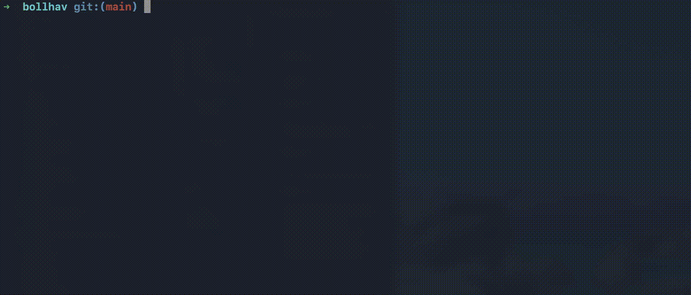

# Progress Bar

The progress bar decorator tracks execution of batched models. Set the `PROGRESS_BAR` environment variable to control verbosity.

## Levels

### `minimal`

Prints a single summary line when all models are done.

```
✓ 11 models done  3.0s
```

Best for production — no per-model or per-batch output, no spinning animation. One line total.


### `model` (default)

Prints one line per completed model.

```
✓ customers       110ms 3/3 á  36ms
✓ orders          1.2s  9/9 á 130ms
✓ products        4.5s 25/25 á 180ms
```

Each line shows: model name, total elapsed time, batches completed, and average batch duration. No spinning animation.



### `batch`

Shows a live spinner with per-batch progress, then a finish line per model.

```
⠋ orders  █████████░░░░░░░░░░░ 45% 3/9 á 130ms ~1.2s left
✓ orders          1.2s  9/9 á 130ms
```

The spinner animates at 0.3s intervals. In a terminal it overwrites the same line. In logged output (e.g. CI/CD) each spinner frame becomes its own line — use `model` or `minimal` in production to avoid noisy logs.


## Usage

```bash
# default (model)
python main.py

# minimal for production
PROGRESS_BAR=minimal python main.py

# batch for local development
PROGRESS_BAR=batch python main.py
```
