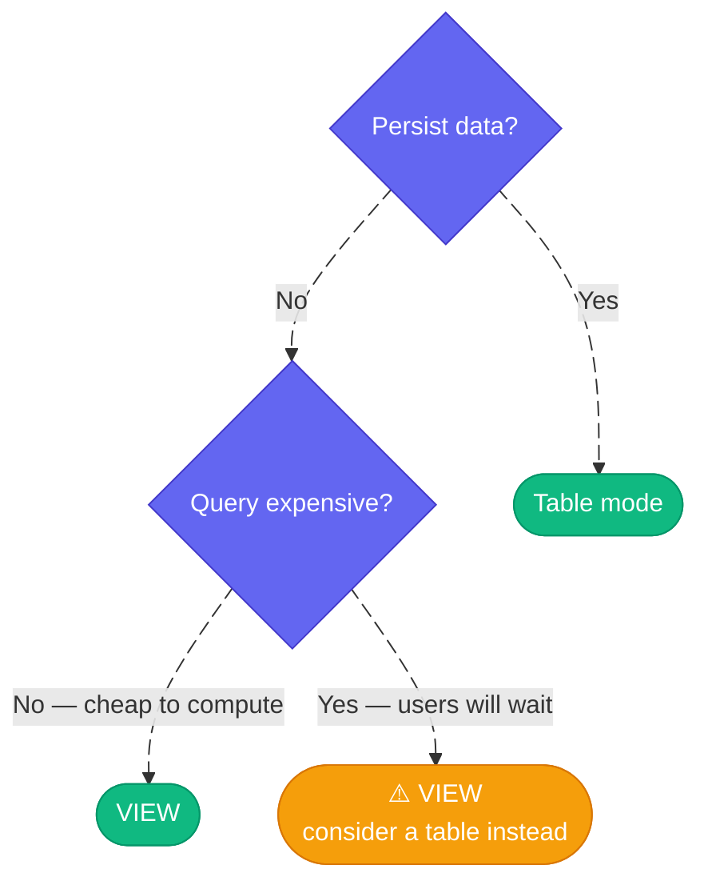

[back to choosing a write mode](WRITEMODES.md#decision-trees) — [which table mode?](WHICH_TABLE_MODE.md)

# View or table?

```mermaid
flowchart TD
    V1{Persist data?}:::question
    V2{Query expensive?}:::question
    TABLE([Table mode]):::mode
    VIEW([VIEW]):::mode
    WARN([⚠️ VIEW<br>consider a table instead]):::caution

    V1 e1@-->|Yes| TABLE
    V1 e2@-->|No| V2
    V2 e3@-->|No — cheap to compute| VIEW
    V2 e4@-->|Yes — users will wait| WARN

    e1@{ animation: fast }
    e2@{ animation: fast }
    e3@{ animation: fast }
    e4@{ animation: fast }

    classDef question fill:#6366f1,stroke:#4338ca,color:#fff
    classDef mode fill:#10b981,stroke:#059669,color:#fff
    classDef caution fill:#f59e0b,stroke:#d97706,color:#fff
```
