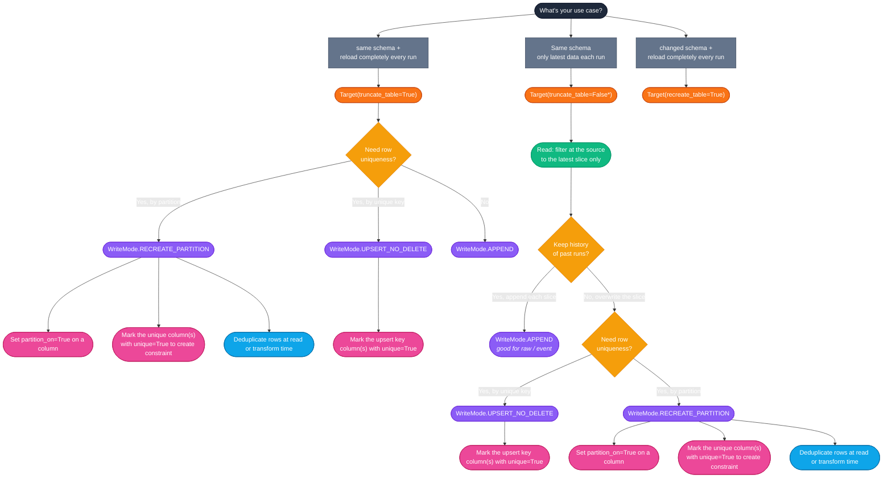
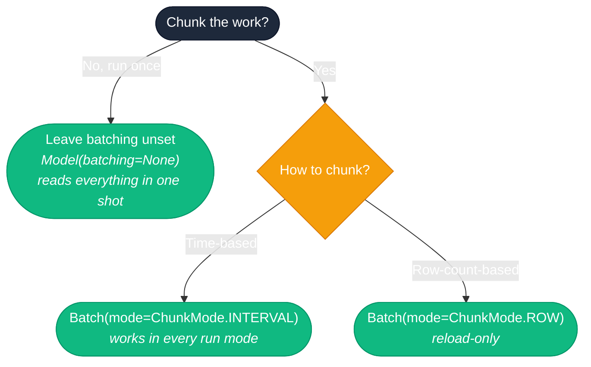

[back to README](../../README.md) — [model reference](MODEL.md) — [write modes](WRITEMODES.md) — [which write mode?](WHICH_TABLE_MODE.md)

# Which setup?

Pick a use case, follow the questions, land on the exact `Target` / `WriteMode` fields to set on the `Model` — plus the actions needed to make the write mode work correctly.

\* Default — you can omit it entirely. `truncate_table` and `recreate_table` both default to `False`; setting them explicitly just makes the intent visible.

## Chunking

Chunking is orthogonal to the write mode — any of the write modes above can be chunked, or not.

