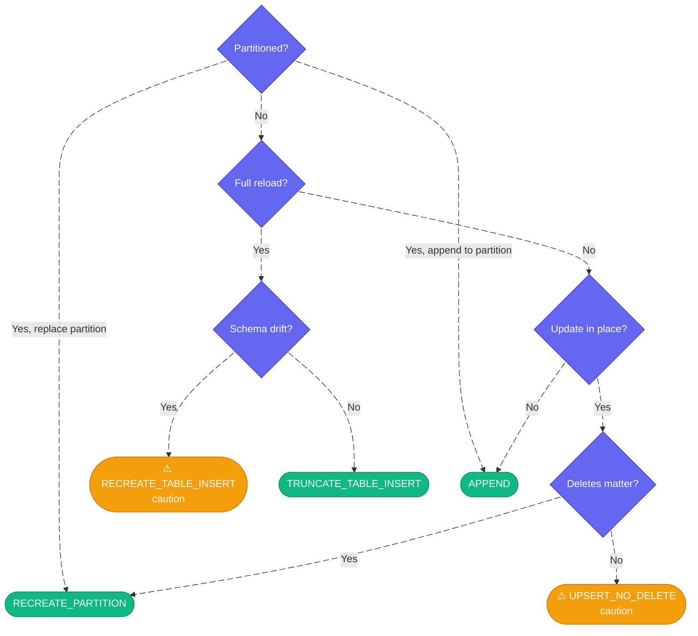

[back to choosing a write mode](WRITEMODES.md#decision-trees) — [view or table?](VIEW_OR_TABLE.md)

# Which table mode?

```mermaid
flowchart TD
    Q2{Partitioned?}:::question
    Q3{Full reload?}:::question
    Q4{Schema drift?}:::question
    Q5{Update in place?}:::question
    Q6{Deletes matter?}:::question

    RP([RECREATE_PARTITION]):::mode
    RTI([⚠️ RECREATE_TABLE_INSERT<br>caution]):::caution
    TTI([TRUNCATE_TABLE_INSERT]):::mode
    UND([⚠️ UPSERT_NO_DELETE<br>caution]):::caution
    APP([APPEND]):::mode

    Q2 e3@-->|Yes, replace partition| RP
    Q2 e4@-->|Yes, append to partition| APP
    Q2 e5b@-->|No| Q3
    Q3 e5@-->|Yes| Q4
    Q3 e6@-->|No| Q5
    Q4 e7@-->|Yes| RTI
    Q4 e8@-->|No| TTI
    Q5 e9@-->|Yes| Q6
    Q5 e10@-->|No| APP
    Q6 e11@-->|No| UND
    Q6 e12@-->|Yes| RP

    e3@{ animation: fast }
    e4@{ animation: fast }
    e5b@{ animation: fast }
    e5@{ animation: fast }
    e6@{ animation: fast }
    e7@{ animation: fast }
    e8@{ animation: fast }
    e9@{ animation: fast }
    e10@{ animation: fast }
    e11@{ animation: fast }
    e12@{ animation: fast }

    classDef question fill:#6366f1,stroke:#4338ca,color:#fff
    classDef mode fill:#10b981,stroke:#059669,color:#fff
    classDef caution fill:#f59e0b,stroke:#d97706,color:#fff
```
