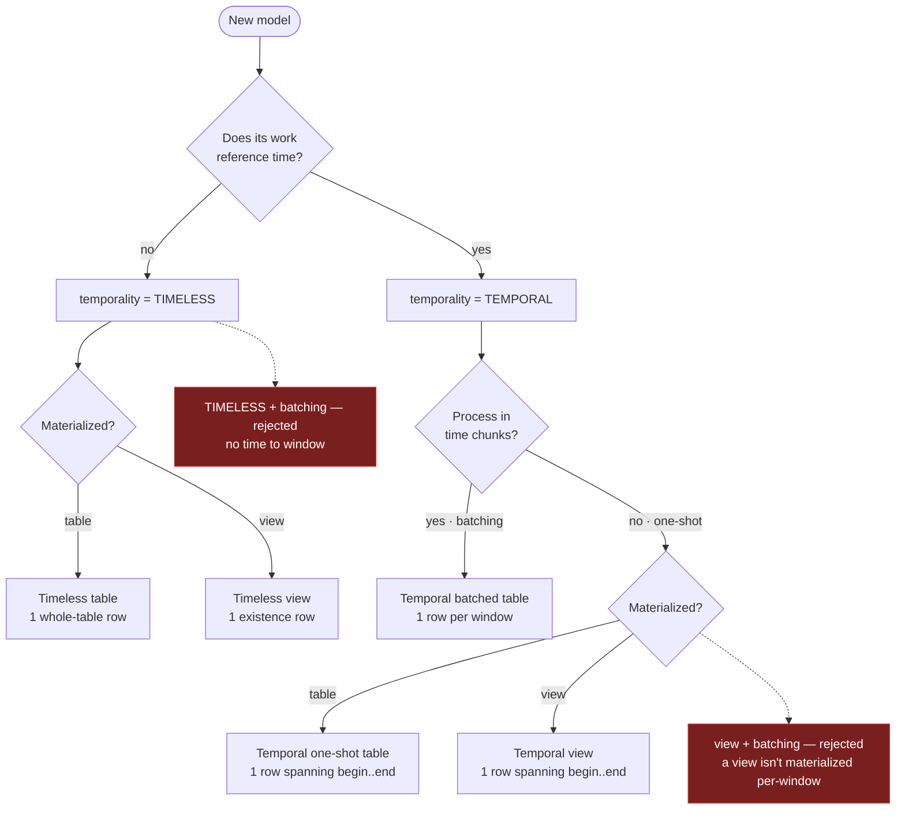

[Home](index.md) › [Model](MODEL.md) › **Temporality**

# Temporality

A model's temporality is whether its unit of work has a **time axis**: `TEMPORAL` or `TIMELESS`. The temporality decides its unit of work, how many state rows it has, and how a downstream [contract](UPSTREAM.md) checks it.

`temporality` defaults to `Temporality.TEMPORAL` (the common case). Set it explicitly from the `Temporality` enum when a model is timeless.

```python
from bollhav.model import Temporality
```

| temporality | unit of work | state rows |
|---|---|---|
| `Temporality.TEMPORAL` | a time window — or, unbatched, the whole `[begin, end]` range | one per window (batched) · one (unbatched) |
| `Temporality.TIMELESS` | the whole thing | one |

A **`TEMPORAL`** model has a [`Contract`](CONTRACT.md) time window. With `batching` it splits that window into chunks (one state row per window); without `batching` it loads its whole `[begin, end]` range in one run (one state row spanning the range). A **`TIMELESS`** model has no time axis — no `batching`, and no `begin`/`end`.

## View vs table

Materialization is a **separate** flag from the time axis. By default a model produces a materialized table; `view=True` makes it a SQL view (`CREATE OR REPLACE VIEW` from its defining `SourceModel(query=…)`).

```python
Model(temporality=Temporality.TEMPORAL, batching=Batch(...), ...)  # a windowed table
Model(temporality=Temporality.TIMELESS, ...)                       # a whole-table load
Model(temporality=Temporality.TIMELESS, view=True, ...)            # a timeless view
Model(temporality=Temporality.TEMPORAL, view=True,                 # a temporal view —
      contract=Contract(begin=..., end=...), ...)    #   its Contract is the range it covers
```

A view **can't be batched** — it's one `CREATE VIEW`, not materialized per-window. Its temporality is otherwise free: `TEMPORAL`, where its [`Contract`](CONTRACT.md) `begin`/`end` declares the range it covers (recorded as a single state row a downstream can gate `WINDOW` against), or `TIMELESS` (existence only).

## Validation

The temporality and its companions must agree, caught at construction:

- `Temporality.TIMELESS` **with** `batching` raises — a timeless model isn't windowed.
- `Temporality.TIMELESS` **with** a `Contract` `begin`/`end` raises — no time to bound.
- `view=True` **with** `batching` raises — a view isn't materialized per-window.

## Units per run

`run.intervals` (on the `ModelRun` from `@load_models`) yields one window per unit for a **batched** temporal model; a single `None` for a **timeless** model (or an unbatched temporal model with no declared range); and one interval spanning `[begin, end]` for an **unbatched** temporal model with a contract range — so the same loop runs the unit of work the right number of times.

## Combinations

Two independent questions decide a model's shape — *has a time axis?* (`TEMPORAL` / `TIMELESS`) and *materialized as a table or a view?* (`view=`) — plus, for temporal tables only, *chunk it?* (`batching`).



| Combo | Declare | State | Gate it with | Use when |
|---|---|---|---|---|
| **Temporal batched table** | `temporality=TEMPORAL, batching=Batch(...)` | one row **per window** | `WINDOW` / `THROUGH` / `WHOLE` / `EXISTS` | The default for incremental fact/event tables — daily/hourly loads, backfills, anything processed and resumed per time window. |
| **Temporal one-shot table** | `temporality=TEMPORAL, contract=Contract(begin,end)` (no batching) | one row spanning **[begin,end]** | `WINDOW` (window ⊆ range) / `WHOLE` / `EXISTS` | A time-bounded table loaded in a single pass — small enough not to chunk, or the source only does a whole-range read — but downstreams still ask "is my window covered." |
| **Timeless table** | `temporality=TIMELESS` | one **whole-table** row | `WHOLE` / `EXISTS` (not `WINDOW`) | Dimensions, reference / lookup tables, config — no time axis, reloaded wholesale. The only question is "is it loaded." |
| **Temporal view** | `temporality=TEMPORAL, view=True, contract=Contract(begin,end)` | one row spanning **[begin,end]** (no data) | `WINDOW` (window ⊆ range) / `WHOLE` / `EXISTS` | A SQL view over time-ranged data where consumers care "is this view current through my window." Declare the range; enforce it by gating the view's own source `WINDOW`. |
| **Timeless view** | `temporality=TIMELESS, view=True` | one **existence** row (no data) | `WHOLE` / `EXISTS` | A plain view — renames, joins, projections, lookups — where the only question is "does it exist." |

The two rejected corners each follow from one rule: **timeless can't batch** (batching chops a *time window*, and there's no time axis), and **a view can't batch** (batching is per-window *materialization*, and a view materializes nothing — its only way to carry time is the one-shot `[begin, end]` row).

## See also

- [Contract](CONTRACT.md) — a temporal model's `begin`/`end` window.
- [Upstream](UPSTREAM.md) — depending on another model, and the contract levels.
- [State](STATE.md) — the rows each temporality records.
