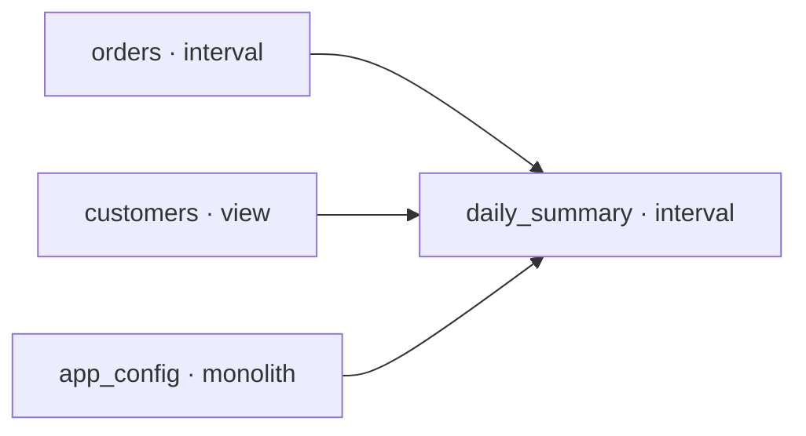

[Home](index.md) › [Articles](ARTICLES.md) › **Lineage**

# Lineage

!!! note "Forward-looking"
    Lineage isn't a built-in command yet. This sketches how it falls out of the [model library](LIBRARY.md) almost for free, and what shape it would take.

bollhav already persists the dependency graph. The library records every model and its upstreams as a side effect of running, so a lineage graph is **derivable from one query** — no SQL to parse, no separate manifest to maintain.

## It's already in the library

`z_bollhav.model_library` stores, per model: `full_name`, `upstream`, `kind`, `model_type`, `state_schema`, `state_table`, `last_seen`. [`register_model`](LIBRARY.md) writes this on every run. So:

```sql
SELECT full_name, upstream, kind FROM z_bollhav.model_library ORDER BY full_name;
```

Each row is a **node** (`full_name`, typed by `kind`); each name in its `upstream` is an **edge**. That's the whole graph — the lineage is the library, read sideways.

## What makes it different from dbt-style lineage

| Property | bollhav (from the library) | dbt |
|---|---|---|
| Source of the graph | the persisted library (`upstream` + `full_name`) | parsed `ref()`/`source()` in SQL |
| Scope | **cross-pipeline** — every repo/run against the same state DB | one project's DAG |
| Runtime awareness | **state-aware** — edges sit next to the state tables | static, compile-time |
| Edge semantics | typed by `kind` (interval window / view gate / whole-table) | uniform refs |
| Column-level | not available (see the catch) | yes, from SQL parsing |

Three things stand out — and they're exactly where dbt's static, per-project lineage is weak:

1. **Cross-pipeline.** The library spans every pipeline that registers against the same state DB, so a [contract](UPSTREAM.md) on a model shipped in a *different* repo is still an edge. Org-wide lineage, not one project.
2. **State-aware.** Because the edges live next to the [state](STATE.md) rows, the graph can be coloured by status — this edge is `applied` through 2024-03-01, that downstream is `blocked` because its upstream's window isn't covered. Lineage **and** freshness in one view, closer to an observability graph than a static DAG.
3. **Typed edges.** Each node already knows its `kind`, so the graph can render the *semantics* of a dependency (a daily interval covering an hourly downstream, a view existence gate, a whole-table load) — not just an arrow.

## The catch

The flip side of bollhav's "bring your own Python transform":

- **Model-level is free; column-level is hard.** The transform is opaque Python (`read()` / `execute`), so there's nothing to introspect for column mapping. dbt gets column lineage by parsing `select a, b from ref(...)`; bollhav can't without explicit annotations on the model or static analysis of the Python. Expect a model-granular graph, not column-granular.
- **Only as complete as registration.** A model that has never run isn't in the library, so the graph reflects *what has registered*, not *what's declared in code*. Registering at match time (`@load_models`) rather than only on run would close that gap.

## Sketch: rendering it

The graph is a one-query transform away — resolve `upstream` names to edges and emit a diagram:

```python
rows = conn.execute(
    "SELECT full_name, upstream, kind FROM z_bollhav.model_library"
).fetchall()
edges = [(up, name) for name, upstream, kind in rows for up in upstream]
# -> feed `edges` to mermaid / graphviz, colour nodes by `kind`,
#    optionally join the state tables to colour edges by status.
```



A **model-level, cross-pipeline, state-aware** lineage graph straight from `model_library` — distinctive precisely where dbt is weak, lighter where dbt is strong.

## See also

- [Library](LIBRARY.md) — the registry the graph is read from.
- [Upstream](UPSTREAM.md) · [State](STATE.md) · [Orchestration](ORCHESTRATION.md)
