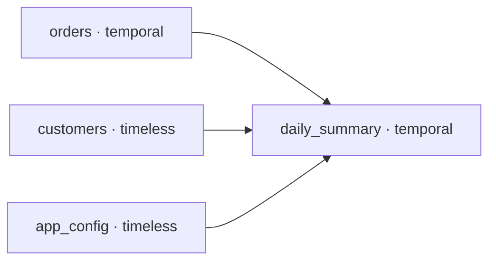

[Home](index.md) › [Articles](ARTICLES.md) › **Lineage**

# Lineage

Where a model's data comes from. Each model declares its inputs, so you can inspect one model's lineage in code (no database), or read the whole cross-pipeline graph from the [library](LIBRARY.md).

A model's inputs come in two flavours, both feeding the graph:

- [**Upstream**](UPSTREAM.md) — managed, state-tracked models. Internal edges (model → model).
- [**Sources**](UPSTREAM.md#ungated-sources) — external, unmanaged inputs (raw tables, APIs, files). Boundary nodes where data enters the system.

A model that declares neither has unknown provenance (`model.inputs_known is False`) — exactly the gap a lineage audit wants to flag.

## Inspect one model's lineage in code

A `Model` can describe its **own** declared inputs without any database — useful for a quick look, a CI check, or feeding a diagram. Each input is typed: a gated [upstream](UPSTREAM.md) by its [contract level](UPSTREAM.md#contracts-gating) (`exists` / `exact` / `encapsulate` / `through` / `whole`), an ungated [source](UPSTREAM.md#ungated-sources) by its type (`model` / `file` / `api` / `hardcoded`).

`model.lineage_tree()` returns a little ASCII tree:

```python
print(model.lineage_tree())
```
```text
warehouse.daily_summary (temporal)
├─ upstream
│  ├─ warehouse.orders (window)
│  ├─ warehouse.events (window)
│  ├─ warehouse.customers (whole)
│  └─ warehouse.app_config (exists)
└─ sources
   ├─ raw.landing_orders (database)
   ├─ vendor.api_orders (api)
   └─ dropzone/customers.csv (file)
```

`model.lineage_json()` returns the same thing as JSON (handy for tooling / a manifest):

```python
print(model.lineage_json())
```
```json
{
  "model": "warehouse.daily_summary",
  "kind": "temporal",
  "upstream": [
    {"name": "warehouse.orders", "kind": "window"},
    {"name": "warehouse.customers", "kind": "whole"}
  ],
  "sources": [
    {"name": "raw.landing_orders", "kind": "database"},
    {"name": "vendor.api_orders", "kind": "api"}
  ],
  "inputs_known": true
}
```

Supporting accessors:

| Member | Returns |
|---|---|
| `model.lineage()` | the structured dict (basis for both renderers) |
| `model.lineage_json(indent=2)` | `lineage()` serialized to JSON |
| `model.lineage_tree()` | the ASCII tree string |
| `model.upstream_specs` | `[{"name", "kind"}]` — kind is the contract level; `None` for a bare-string upstream |
| `model.source_specs` | `[{"name", "kind"}]` — bare-string sources default to `database` |
| `model.declared_inputs` / `model.inputs_known` | all input names / whether any are declared |

A model with no upstreams and no sources renders `(no declared inputs — provenance unknown)`.

This is the **single-model, in-code** view. The **cross-pipeline graph** below is read from the library instead.

## It's already in the library

!!! note "Forward-looking"
    The cross-pipeline graph below isn't a built-in command yet — it sketches how it falls out of the [library](LIBRARY.md) almost for free. (The per-model `lineage_*()` methods above *are* built in.)


`z_bollhav.library` stores, per model: `full_name`, `upstream`, `temporality`, `model_type`, `state_schema`, `state_table`, `last_seen`. [`register_model`](LIBRARY.md) writes this on every run. So:

```sql
SELECT full_name, upstream, temporality FROM z_bollhav.library ORDER BY full_name;
```

Each row is a **node** (`full_name`, typed by `temporality`); each name in its `upstream` is an **edge**. That's the whole graph — the lineage is the library, read sideways.

## What makes it different from dbt-style lineage

| Property | bollhav (from the library) | dbt |
|---|---|---|
| Source of the graph | the persisted library (`upstream` + `full_name`) | parsed `ref()`/`source()` in SQL |
| Scope | **cross-pipeline** — every repo/run against the same state DB | one project's DAG |
| Runtime awareness | **state-aware** — edges sit next to the state tables | static, compile-time |
| Edge semantics | nodes typed by `temporality` (temporal / timeless); edges carry the contract level | uniform refs |
| Column-level | not available (see the catch) | yes, from SQL parsing |

Three things stand out — and they're exactly where dbt's static, per-project lineage is weak:

1. **Cross-pipeline.** The library spans every pipeline that registers against the same state DB, so a [contract](UPSTREAM.md) on a model shipped in a *different* repo is still an edge. Org-wide lineage, not one project.
2. **State-aware.** Because the edges live next to the [state](STATE.md) rows, the graph can be coloured by status — this edge is `applied` through 2024-03-01, that downstream is `blocked` because its upstream's window isn't covered. Lineage **and** freshness in one view, closer to an observability graph than a static DAG.
3. **Typed edges.** Each node knows its `temporality` and each edge its contract level, so the graph can render the *semantics* of a dependency (an `ENCAPSULATE` contract covering an hourly downstream, an `EXISTS` gate, a `WHOLE` load) — not just an arrow.

## The catch

The flip side of bollhav's "bring your own Python transform":

- **Model-level is free; column-level is hard.** The transform is opaque Python (`read()` / `execute`), so there's nothing to introspect for column mapping. dbt gets column lineage by parsing `select a, b from ref(...)`; bollhav can't without explicit annotations on the model or static analysis of the Python. Expect a model-granular graph, not column-granular.
- **Only as complete as registration.** A model that has never run isn't in the library, so the graph reflects *what has registered*, not *what's declared in code*. Registering at match time (`@load_models`) rather than only on run would close that gap.

## Sketch: rendering it

The graph is a one-query transform away — resolve `upstream` names to edges and emit a diagram:

```python
rows = conn.execute(
    "SELECT full_name, upstream, temporality FROM z_bollhav.library"
).fetchall()
edges = [(up, name) for name, upstream, temporality in rows for up in upstream]
# -> feed `edges` to mermaid / graphviz, colour nodes by `temporality`,
#    optionally join the state tables to colour edges by status.
```



A **model-level, cross-pipeline, state-aware** lineage graph straight from `library` — distinctive precisely where dbt is weak, lighter where dbt is strong.

## See also

- [Library](LIBRARY.md) — the registry the graph is read from.
- [Upstream](UPSTREAM.md) — managed edges and `ref()`.
- [Sources](UPSTREAM.md#ungated-sources) — ungated external boundary nodes; `ref()` resolution.
- [State](STATE.md) · [Orchestration](ORCHESTRATION.md)
