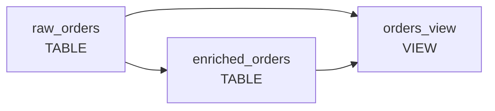
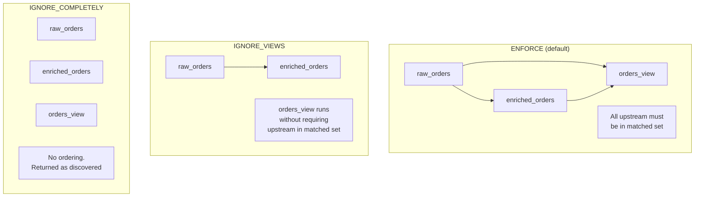

[Home](index.md) › **Model**

# Model

A `Model` is a pure data object describing what data looks like and where it goes. It does not contain execution logic — that lives in a separate `execute` function that receives the model as a parameter.

## Kind

Every model declares a required `kind`, the single source of truth for its unit of work. The state layer and upstream contracts key on it.

| `kind` | Meaning |
|---|---|
| `Kind.INTERVAL` | Batched table; unit of work is one `(since, until)` window. Requires `batching`. |
| `Kind.MONOLITHIC` | Whole-table load; one unit. Must not have `batching`. |
| `Kind.VIEW` | A view; unit of work is its existence. No `batching` / `staging`. |

```python
from bollhav.model import Kind
```

See [Kinds](KINDS.md) for the full reference.

The `Model` itself is the top-level container. Its sub-objects each have their own page:

- [Kind](KINDS.md) — the model's unit of work (`INTERVAL` / `MONOLITHIC` / `VIEW`)
- [Target](TARGET.md) — where data lands (table, schema, columns, write mode)
- [Staging](STAGING.md) — optional staging table on Target
- [Bounds](BOUNDS.md) — historical envelope for backfill mode
- [Batch](BATCH.md) — chunk size, lookback, retries
- [State](STATE.md) — per-model state tracking
- [Upstream](UPSTREAM.md) — the model's inputs (`list[Source]`): gated upstreams + ungated sources
- [SourceModel](SOURCETABLE.md) / [SourceFile](SOURCEFILE.md) — input `type`s
- [Tagging](TAGGING.md) — controls which auto-derived tags get added to the model

## Example

```python
from datetime import datetime, timezone
from bollhav.model import (
    Model, Kind, Target, Source, SourceModel,
    Bounds, Batch, Database, WriteMode,
)
from bollhav.postgres import PostgresColumn, PostgresType

model = Model(
    kind=Kind.INTERVAL,
    target=Target(
        name="orders",
        schema="public",
        database=Database.POSTGRES,
        columns=[
            PostgresColumn(name="id", data_type=PostgresType.BIGINT, primary_key=True, nullable=False),
            PostgresColumn(name="created_at", data_type=PostgresType.TIMESTAMPTZ, nullable=False, partition_on=True),
            PostgresColumn(name="email", data_type=PostgresType.TEXT, nullable=True, sensitive=True),
        ],
        write_mode=WriteMode.APPEND,
    ),
    upstream=[Source("raw.orders", type=SourceModel())],
    bounds=Bounds(begin=datetime(2024, 1, 1, tzinfo=timezone.utc)),
    batching=Batch(interval_expression="0 * * * *"),
    debug=True,
)
```

## Parameters

### kind

Type: `Kind` · Default: required

The model's unit of work: `Kind.INTERVAL`, `Kind.MONOLITHIC`, or `Kind.VIEW`. See [Kind](#kind) above and [Kinds](KINDS.md).

### target

Type: `Target` · Default: required

Defines where and how data is written. See [Target](TARGET.md).

### upstream

Type: `list[Source]` · Default: `[]`

The model's inputs — gated upstreams (a `Source` with a `contract`) and ungated sources (no contract), in one list. See [Upstream](UPSTREAM.md); input `type`s are [SourceModel](SOURCETABLE.md) / [SourceFile](SOURCEFILE.md) / `SourceApi`.

### bounds

Type: `Bounds` · Default: `None`

Optional backfill begin/end bounds. See [Bounds](BOUNDS.md).

### batching

Type: `Batch` · Default: `None`

Controls chunk size and retries. When `None`, the model runs as a single unit — see [Chunking](CHUNKING.md). See [Batch](BATCH.md) for the field reference.

### tagging

Type: `Tags` · Default: `None`

Controls tag auto-assembly. See [Tagging](TAGGING.md) for the config object; see [Tags](TAGS.md) for the expression syntax used to select models at runtime.

### enabled

Type: `bool` · Default: `True`

Whether the model is active.

### debug

Type: `bool` · Default: `False`

Pretty-prints the model at construction time. See [Debug](#debug) below.

### description

Type: `str` · Default: `None`

Human-readable description.

### `**kwargs`

Extra metadata. Callable values are resolved with non-callable kwargs as arguments.

## Computed attributes

| Attribute | Description |
|---|---|
| `is_table` | `True` for any non-view kind (`INTERVAL` / `MONOLITHIC`) |
| `is_view` | `True` when `kind=Kind.VIEW` |
| `is_kind_interval` | `True` when `kind=Kind.INTERVAL` |
| `is_kind_monolithic` | `True` when `kind=Kind.MONOLITHIC` |
| `is_kind_view` | `True` when `kind=Kind.VIEW` |
| `target.sensitive` | `True` if any column has `sensitive=True` |
| `target.unique_columns` | Columns with `unique=True` — required for `UPSERT_NO_DELETE` |
| `target.partitioned_by_index` | `True` if `partitioned_by` is set |
| `tags` | Auto-assembled from `name`, `target.schema`, and `"all"` |

## Upstream dependencies

Models can declare dependencies on other models using the `upstream` parameter. When `apply_runtime_overrides` (or `match_models` directly) returns results, they are topologically sorted so that upstream models always appear before their dependents.

```python
raw_orders = Model(
    target=Target(name="raw_orders"),
)

enriched_orders = Model(
    target=Target(name="enriched_orders"),
    upstream=[Source("raw_orders", type=SourceModel())],
)
```

An upstream that isn't in the matched set is **not** an error — it ships in another pipeline or under different `TAGS`, and its satisfaction is checked at runtime against the cross-pipeline state library (see [Upstream](UPSTREAM.md)), not at match time. Matching only **orders** the models it matched.

Circular dependencies among matched models are detected and raise a `ValueError`.

### Upstream mode

`upstream_mode` controls how matched models are **ordered** by their upstreams. It can be set via the `UPSTREAM` environment variable (read by `@load_models`) or passed directly to `match_models` / `apply_runtime_overrides`. It governs ordering only — whether an upstream is *satisfied* is a runtime concern of the [contract](UPSTREAM.md) layer, not of matching.

| Mode | Value | Description |
|---|---|---|
| `ENFORCE` | `enforce` | Topologically order matched models so each runs after its matched upstreams (default). Unmatched upstreams are skipped; circular deps raise. |
| `IGNORE_VIEWS` | `ignore_views` | Views are not ordered against their upstreams (treated as having none); tables are still ordered |
| `IGNORE_COMPLETELY` | `ignore_completely` | No ordering, models returned as-is |

```bash
export UPSTREAM=ignore_views
```

```python
from bollhav.model import match_models, UpstreamMode

match_models(folder="src/models", tags="[all]", upstream_mode=UpstreamMode.IGNORE_VIEWS)
# or, more commonly, just `@load_models` and let it read UPSTREAM from env.
```

Given these models:



Each mode behaves differently:



## Debug

When `debug=True`, the model is pretty-printed at construction time — every field is dumped to stdout in a readable layout so you can see exactly how bollhav resolved the configuration: the target (catalog/schema/name, columns, write mode), source, bounds, batching (interval/window expressions, size, lookback, retries), tags (both user-supplied and auto-assembled), upstream dependencies, and directives. Use this when you're not sure what bollhav inferred from your `Model(...)` call, or when a runtime override or tag-driven mutation has reshaped the model and you want to see the final state.

You can also call it manually at any point:

```python
model.pretty()
```

## Write modes

Read more in [Write modes](WRITEMODES.md). A view is `kind=Kind.VIEW`, not a write mode.

```python
from bollhav.model.write_modes import WriteMode

WriteMode.APPEND
WriteMode.RECREATE_PARTITION     # requires partitioned_by
WriteMode.UPSERT_NO_DELETE       # requires at least one column with unique=True
```

For full-reload semantics, combine a write mode with `Target(recreate_table=True)` or `Target(truncate_table=True)` — these run once before the chunked write loop (see [MODES.md](MODES.md#pre-load-flags-recreate_table-and-truncate_table)).
