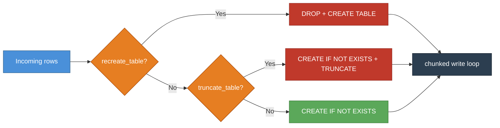
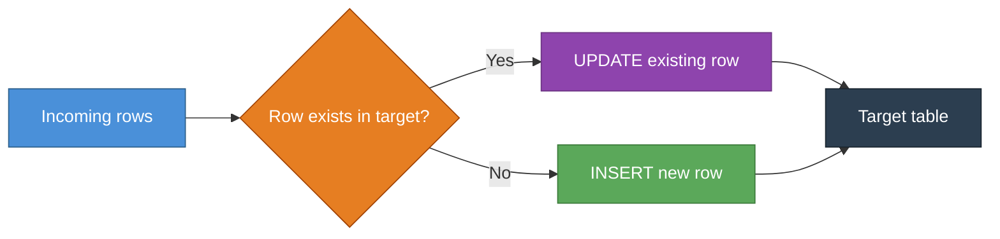
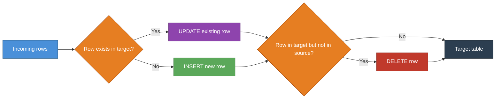
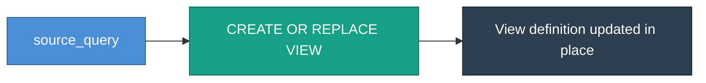

[Home](index.md) › **Write modes**

# Write modes

Describes how data is written to the target table or view. This is just a naming convention, you can use the implementations in this library, or build your own for your own needs.

## APPEND

Simply appends incoming rows to the target. No deduplication, no deletes.

### When to use:
- When the resulting size does not matter
- We want to save rows immediately (as to not break our pipeline, like in raw)
- Duplicates are okay

## Pre-load flags: `recreate_table` and `truncate_table`

Two booleans on `Target` that compose with any write mode. They run **once** in `ensure_table`, before the chunked write loop — so they're safe to combine with row-chunked or interval-chunked batching without clobbering earlier chunks.

- `recreate_table=True` → `DROP TABLE IF EXISTS` then `CREATE TABLE`. Resets schema. Use when column definitions have changed.
- `truncate_table=True` → `CREATE TABLE IF NOT EXISTS` then `TRUNCATE TABLE`. Wipes rows, keeps schema. Use when you want a full reload but the schema is stable.

Both default to `False`. Setting both is an error. Neither applies to a view (views are not a write mode).

Typical combinations:
- `APPEND` + `truncate_table=True` → idempotent full reload
- `APPEND` + `recreate_table=True` → idempotent full reload with schema reset
- `UPSERT_NO_DELETE` + `truncate_table=True` → wipe then upsert (useful when the incoming data has duplicates)

## UPSERT_NO_DELETE

Updates rows that already exist, inserts rows that don't. Never deletes.

### When to use:
- This is much like a MERGE statement, where deduplication is handled.
- Duplicates are not okay
- When we want to make sure that deletes from source are _NOT_ handled
- This relies on a unique key constraint
- NOT IDEMPOTENT

## RECREATE_PARTITION

Deletes matching rows first, then inserts all incoming rows fresh. Effectively a targeted replace.

### When to use:
- This is much like a MERGE statement, where deduplication is handled.
- Duplicates are not okay
- When we want to make sure that deletes from source _ARE_ handled
- IDEMPOTENT

---

## MERGE

Full sync — updates existing, inserts new, and deletes rows that are no longer in the source. Requires Postgres 15+.

### When to use:
- Wait until postgres 15

## Views

A view is **not** a write mode — it's `materialization=Materialization.VIEW` on the model (timeless, or temporal with a `Contract` range it covers). It writes no data; the lifecycle runs `CREATE OR REPLACE VIEW` from the model's defining `query` (its SELECT body).

### When to use:
- Simple renaming of columns
- Useful for segregating data
- Does not persist data, which means the result is calculated on each use

## Summary

| Mode | Inserts | Updates | Deletes | Notes |
|---|---|---|---|---|
| `APPEND` | ✅ | ❌ | ❌ | No deduplication. Pair with `truncate_table=True` or `recreate_table=True` for full reloads |
| `UPSERT_NO_DELETE` | ✅ | ✅ | ❌ | Safe upsert |
| `RECREATE_PARTITION` | ✅ | ✅ | ✅ | Deletes matches first |
| `MERGE` | ✅ | ✅ | ✅ | Requires Postgres 15+ |

A **view** is not a write mode — see [Views](#views); set `materialization=Materialization.VIEW` instead.

### Pre-load flags (on `Target`)

| Flag | Effect before load |
|---|---|
| `recreate_table=True` | `DROP` + `CREATE TABLE` (schema reset) |
| `truncate_table=True` | `CREATE IF NOT EXISTS` + `TRUNCATE TABLE` |