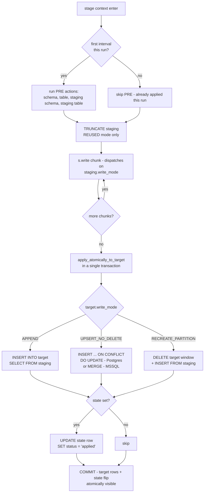
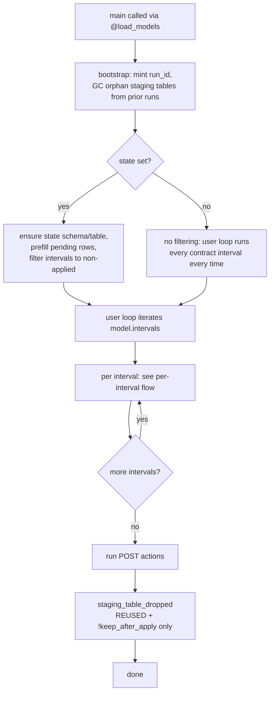

[← Target](TARGET.md)

# Staging

Per-target opt-in for memory-bounded chunked writes plus atomic per-interval finalization. Set `Target(staging=Staging(...))` and the `write()` dispatcher routes through the staged path: sub-batches land in a staging table; one transaction at the end applies the staged content to the target and (when `state=State(...)` is also set) flips the state row to `applied`.

Supported on both backends:

- **Postgres** — `bollhav.postgres.staging` (chunks via `COPY`, apply via `INSERT ... SELECT` / `... ON CONFLICT` / `DELETE + INSERT`).
- **MSSQL** — `bollhav.mssql.staging` (chunks via `fast_executemany`, apply via `INSERT ... SELECT` / `MERGE` / `DELETE + INSERT`). State coordination is Postgres-only for now.

## What you get

- **Memory bounding.** Sub-batches go straight to a staging table; nothing accumulates in Python.
- **Atomic per-interval finalization.** The apply step commits the staging-to-target move + (optional) state flip together. Either the target has every row of the interval *and* the state row says `applied`, or neither.
- **Resumability** (when paired with state). A crash mid-stream leaves the staging table behind and the state row stays non-`applied`; the next run picks up that interval.
- **Concurrency-safe naming.** The staging table name embeds the bootstrap-minted `run_id`, so two workers running on the same model don't collide on one shared table.

## Per-interval flow

Inside `stage(conn, model, since=..., until=...) as s:`:



The dotted "first interval this run?" guard is what makes the PRE actions one-shot — subsequent intervals short-circuit via `target._applied_model_actions` and don't re-issue the CREATE statements.

## Per-run flow

The pipeline run as seen from `@load_models`:



Without state, the bootstrap still mints a `run_id` (the staging table name uses it) and still GCs orphans — staging-only models benefit from cleanup just like state-tracked ones.

## Opting in

```python
from bollhav.model import Model, Target, Staging, State, WriteMode

Model(
    target=Target(
        name="orders",
        schema=TargetSchema(name="warehouse"),
        dsn_env_var="TARGET_DSN",
        write_mode=WriteMode.APPEND,    # how staging lands in target
        staging=Staging(),              # ← opt-in
        columns=[...],
    ),
    state=State(),                      # optional - see "Without state"
    batching=Batch(...),
)
```

## `Staging.write_mode` — how chunks land *in* staging

| `staging.write_mode` | What `s.write(chunk)` does | Picks when |
|---|---|---|
| `APPEND` *(default)* | bulk-insert / COPY the chunk into staging — no dedup, dupes accumulate | rows are append-only, or you don't care about dupes |
| `UPSERT_NO_DELETE` | MERGE / `ON CONFLICT DO UPDATE` the chunk into staging on `target.unique_columns` — staging stays deduped as data arrives | source has duplicate keys (CDC streams, retried events) and you want them collapsed before the final apply |

`RECREATE_PARTITION` and `VIEW` are rejected on the staging side — staging is per-interval scratch space, not a long-lived partitioned table.

## `target.write_mode` — how staging lands *in* target

The same `WriteMode` enum drives the apply step. All three table modes are supported:

| `target.write_mode` | SQL the apply runs |
|---|---|
| `APPEND` | `INSERT INTO target SELECT FROM staging` |
| `UPSERT_NO_DELETE` | `INSERT INTO target SELECT FROM staging ON CONFLICT (...) DO UPDATE` (Postgres) / `MERGE target USING staging` (MSSQL) |
| `RECREATE_PARTITION` | `DELETE FROM target WHERE partition_col BETWEEN since AND until` + `INSERT INTO target SELECT FROM staging` |

The two write_modes compose orthogonally — four interesting cells:

| staging | target | When to pick |
|---|---|---|
| `APPEND` | `APPEND` | the default; raw streaming into an append-only target |
| `APPEND` | `UPSERT_NO_DELETE` | collect raw rows in staging, MERGE once at the end (one big tx, one target-side lock window) |
| `UPSERT_NO_DELETE` | `UPSERT_NO_DELETE` | dedup early as chunks arrive (staging stays small), MERGE small set at the end |
| `APPEND` | `RECREATE_PARTITION` | replace a time-window's contents atomically |

See [examples/staging_append/](../examples/staging_append/) and [examples/staging_upsert/](../examples/staging_upsert/) for runnable demos.

## `StagingMode` — table lifecycle across intervals

Independent of write_mode; configures whether the staging table persists for the whole pipeline run or gets created fresh per interval.

| Mode | DDL per interval | Total DDL on a 365-interval backfill | Use it when |
|---|---|---|---|
| `REUSED` *(default)* | `TRUNCATE TABLE` (only from interval 2 onward) | 1 × `CREATE SCHEMA` + 1 × `CREATE TABLE` + 364 × `TRUNCATE` + 1 × `DROP` at POST | almost always — minimal catalog churn |
| `INTERVAL` | `CREATE TABLE` + `DROP TABLE` (in apply) | 1 × `CREATE SCHEMA` + 365 × `CREATE` + 365 × `DROP` | you want a forensic snapshot of the crashed-interval staging table on failure |

`REUSED` records two PRE_MODEL actions in `target._applied_model_actions` — `staging_schema_created` and `staging_table_created` — so subsequent intervals short-circuit before issuing the `CREATE`s. See [Actions](ACTIONS.md).

`INTERVAL` doesn't flip `staging_table_created` (the table is genuinely new each interval, so the "did this DDL fire?" flag has nothing to gate).

Both modes share the same table-name shape (`<prefix><run_id_short>`), so parallel workers on the same model don't collide regardless of mode.

## Staging without state

`state=State(...)` is optional. With staging-only:

- Memory bounding and per-interval atomic finalization still work — the apply step commits the staging-to-target move atomically, just **without** flipping a state row that doesn't exist.
- The user's loop re-runs every interval every time. There's no `applied` gate to skip already-completed work. Often what you want for a pure memory-bounding play.
- Re-runs are safe as long as your write is idempotent (`UPSERT_NO_DELETE`, `RECREATE_PARTITION`) or you accept the duplicate-write behaviour of `APPEND`.

```python
Target(
    name="big_dump",
    dsn_env_var="TARGET_DSN",
    write_mode=WriteMode.UPSERT_NO_DELETE,
    staging=Staging(),               # no state= on the model
    columns=[...],
)
```

## Orphan staging tables

A crash mid-stream leaves the per-pipeline-run staging table behind. The next pipeline's bootstrap **auto-invokes `gc_orphan_staging_tables(model)`** for every staging model, dropping any staging table matching the prefix from a prior run. Logs at `debug` per drop, `warning` on connection failure.

You can opt out of auto-GC by setting `Staging(keep_after_apply=True)` — the operator is then responsible for manual cleanup. `keep_after_apply=True` is meaningful in `INTERVAL` mode only; in `REUSED` mode the staging table always stays until the POST `staging_table_dropped` action runs at the end of the pipeline.

## Fields

| Field | Default | Purpose |
|---|---|---|
| `write_mode` | `WriteMode.APPEND` | How chunks land in staging — APPEND or UPSERT_NO_DELETE. See "Staging.write_mode" above. |
| `mode` | `StagingMode.REUSED` | Lifecycle across intervals — see the `StagingMode` table above. |
| `schema` | `None` | Override the default `z_<target_schema>` staging schema. |
| `table_prefix` | `None` | Override the default `<target_name>_staging_` prefix. The `<run_id>` short-hex is always appended. |
| `keep_after_apply` | `False` | `INTERVAL`-only. When `True`, the apply tx skips its `DROP TABLE`. Also disables auto orphan-GC for the model. |

### Postgres-specific (`PostgresStaging`)

| Field | Default | Purpose |
|---|---|---|
| `logged` | `False` | UNLOGGED staging tables by default — writes skip WAL (~2-3× faster `COPY`), crash truncates them harmlessly. Set `True` for environments that mandate WAL on every write. |

```python
from bollhav.postgres.staging import PostgresStaging

Target(staging=PostgresStaging(logged=True, ...))
```

### MSSQL-specific (`MssqlStaging`)

Placeholder subclass — currently carries no MSSQL-only fields. Future home for knobs like `WITH (DURABILITY = SCHEMA_ONLY)` for memory-optimized tables.

```python
from bollhav.mssql.staging import MssqlStaging

Target(staging=MssqlStaging(...))   # same fields as Staging for now
```

## Co-location with state

When state is set, the staging schema **must** live in the same database as the state schema (and therefore the target). Atomicity depends on the apply tx and `UPDATE state` committing together; a cross-database transaction is not supported. Setting `State(dsn_env_var=...)` together with staging raises `NotImplementedError` at `stage()` time.

Without state, the schema-and-target-must-share-a-DB constraint doesn't apply — but `Staging.schema` still defaults to `z_<target_schema>` for consistency.

## Limitations

- **MSSQL + state**: state coordination isn't wired into the MSSQL apply yet — set `State()` only on Postgres targets if you want the atomic state flip. MSSQL staging without state works fine (chunked atomic apply, just no resumability gate).
- **Cross-DB state**: not supported with staging — see "Co-location with state" above.
- See [State](STATE.md) for the resumability story when state is enabled.
