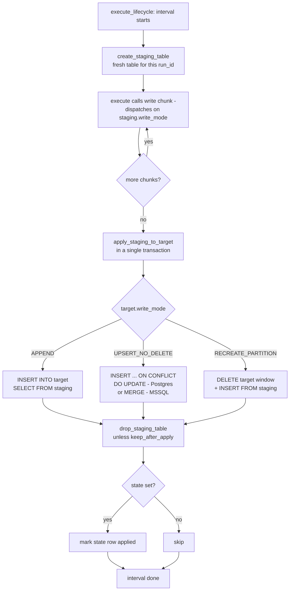
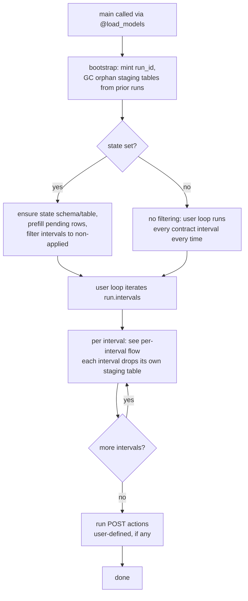

[Home](index.md) › [Model](MODEL.md) › **Target**

# Target

Where data lands: the destination table, its schema, the database connection, column definitions, and the write mode.

## name

Type: `str` · Default: required

Destination table name.

## suffix

Type: `str` · Default: `""`

Appended to `name` at runtime (e.g. `customers` → `customers_v2`). Off by default; set via `TABLE_SUFFIX` env var or programmatically. Used for blue/green hotswap inside a single schema — see [Schema vs table suffix](#schema-vs-table-suffix).

## suffix_appendix

Type: `str | None` · Default: `None`

Optional `strftime` format string appended after `suffix` (e.g. `"%y%V"` → `customers_v2_2614`). Defaults to `None` because hotswap usually wants a stable predictable name; turn it on for throwaway sandbox tables.

## Computed: `name_resolved`

A derived `@property` returning the resolved table name: `name` with `suffix` (and optional `suffix_appendix`) applied. Equals `name` when `suffix` is empty. All DDL bollhav emits (`CREATE TABLE`, index/constraint names) uses `name_resolved` so a suffixed run never collides with the base table.

## schema

Type: `str` · Default: `""`

Destination schema name (just the name — `"warehouse"`). The dev/prod/PR isolation transform is two sibling fields:

- **`schema_suffix`** (`str`, default `""`) — appended as `_<suffix>`. Set per-run, usually from `SCHEMA_SUFFIX` (e.g. `$USER` in dev). Empty = bare schema.
- **`schema_suffix_appendix`** (`str | None`, default `"%y%V"`) — a `strftime` appended after the suffix (default = year+week, so suffixed schemas rotate weekly). `None` to disable.

`Target.schema_resolved` applies them: `warehouse` → `warehouse_pr123_2614_`. (It's a pure view over `schema` — the base name is never mutated, so resolution is idempotent. Note the trailing `_`, kept for back-compat; the *table*-name suffix on `name_resolved` does not add one.)

## catalog

Type: `str` · Default: `None` · **Required when `database` is set**

Destination catalog — the top of three-part addressing (`catalog.schema.table`). **Required on every database-backed model**: a model's identity is `catalog.schema.table`, and the catalog keeps names unique across databases in the shared library, so referencing by anything less risks collisions. Constructing a `Target` with a `database` but no `catalog` raises.

`Target.full_name` is then `catalog.schema_resolved.name_resolved`, and the catalog is added to the model's tags. Note that the catalog is **identity only** — `model.ref(name)` drops it when emitting SQL (it resolves to `schema.table`, since the catalog is the DSN you're already connected on). Abstract Targets (no `database`) may still omit it.

## database

Type: `Database` · Default: `None`

Target database. Required if `columns` is set.

## columns

Type: `list[PostgresColumn]` · Default: `[]`

Column definitions. Required if `database` is set.

## write_mode

Type: `WriteMode` · Default: `APPEND`

How to write data. See [Write modes](#write-modes) for the full list and trade-offs. (Whether a model is a table or a view is `view=True` on the [Model](TEMPORALITY.md), not a Target field.)

## dsn_env_var

Type: `str` · Default: `None`

DSN env var for the target connection.

## Computed: `partitioned_by`

A derived `@property` — set `partition_on=True` on the column you want to partition by; only one column may carry it.

## Write modes

`write_mode` is a property of [Target](TARGET.md) (`WriteMode`, default `APPEND`). A practical guide to picking the right one: `APPEND`, `UPSERT_NO_DELETE`, or `RECREATE_PARTITION`. Views are not a write mode — a view is `view=True` on the [Model](TEMPORALITY.md).

### Pre-load table flags

Two flags on `Target` control what happens to the table **once, before any chunks are written**. They compose with any write mode.

| Flag | Effect |
|---|---|
| `recreate_table=True` | `DROP TABLE IF EXISTS` then `CREATE TABLE` before the load. Resets schema. |
| `truncate_table=True` | `CREATE TABLE IF NOT EXISTS` then `TRUNCATE TABLE` before the load. Keeps schema, wipes rows. |

Both default to `False`. Setting both is an error (recreate already leaves the table empty).

Because the destructive step runs exactly once before the chunk loop, these flags are safe with chunked (INTERVAL or ROW) batching — earlier chunks are not overwritten by later ones.

Typical recipes:
- **Full reload, keep schema** → `WriteMode.APPEND` + `truncate_table=True`
- **Full reload, reset schema** → `WriteMode.APPEND` + `recreate_table=True`
- **Full reload with deduplication** → `WriteMode.UPSERT_NO_DELETE` + `truncate_table=True`

---

### Mode-by-mode breakdown

#### APPEND

| Property | |
|---|---|
| Idempotent | ⚠️ The write always succeeds (operation is idempotent), but re-running duplicates rows (table state is not) |
| Handles source deletes | ❌ (unless paired with `truncate_table` or `recreate_table`) |
| Handles duplicates | Allowed, no check — duplicates are blindly inserted |
| Partition-aware | ✅ Recommended — partitioning the table makes it easier to query and manage data over time, even though APPEND does not act on the partition during writes |
| Backfill | ✅ Works well if duplicates are acceptable downstream — re-running the same window will append again, so deduplication must be handled elsewhere if needed |
| Data volume | ✅ Handles any volume well — blind insert with no overhead per row |
| Persisted | ✅ Written to a physical table |
| Schemaless-friendly | ✅ Best fit — no schema enforcement, any shape of data can be written as long as the target table accepts it |
| Risk of breaking target | Low |
| Effectiveness | Very fast — blind insert, no conflict checks |

**Use when:**
- You are writing to a **RAW layer** — APPEND is the natural fit here, get data in fast and let downstream layers clean it up
- Losing a run means missing data, not corrupting it
- You want maximum write throughput

**Avoid when:**
- Downstream consumers expect unique rows
- You re-run pipelines on failure (every retry appends duplicates — unless paired with `truncate_table=True`)

**Pair with:**
- `truncate_table=True` for idempotent full reloads — wipes rows once, then chunks append cleanly
- `recreate_table=True` when the model's column set has changed and you want the table reshaped before the load

---

#### RECREATE_PARTITION

| Property | |
|---|---|
| Idempotent | ✅ Safe to re-run for the same `since`/`until` window |
| Handles source deletes | ✅ Within the partition window |
| Handles duplicates | Depends — duplicates from previous runs within the window are cleared, but no check on duplicates within the incoming data |
| Partition-aware | ✅ Only touches rows in the `[since, until)` range |
| Backfill | ✅ The natural choice — each batch targets its own window independently, safe to parallelise and re-run |
| Data volume | ✅ Scales well for large tables — cost is proportional to the window size, not the total table size |
| Persisted | ✅ Written to a physical table |
| Schemaless-friendly | ❌ Requires a stable schema and a reliable partition column |
| Risk of breaking target | Low — only affects the specified time window |
| Effectiveness | Efficient for incremental loads on large tables |

**Use when:**
- Your data is naturally partitioned by time (e.g. event date, created_at)
- You process data in batches (hourly, daily) and need to be able to re-run a specific window
- The table is too large to reload fully each run
- Source-table deletes within a window must be reflected

**Avoid when:**
- Your data does not have a reliable partition column
- Rows can legitimately span or shift across partition boundaries (re-running will delete and re-insert them inconsistently)

**Requirements:** `target.partitioned_by` must be set. `since` and `until` (UTC) must be passed at write time.

---

#### UPSERT_NO_DELETE

| Property | |
|---|---|
| Idempotent | ⚠️ Partially — re-running updates existing rows but does not remove rows deleted from source |
| Handles source deletes | ❌ Deleted source rows remain in the target (unless paired with `truncate_table`) |
| Handles duplicates | Not allowed, checked — conflicts on unique key are resolved via ON CONFLICT |
| Partition-aware | ❌ |
| Backfill | ⚠️ Safe to re-run but rows deleted from source during the historical period accumulate permanently — can also be slow on large key spaces due to conflict checking |
| Data volume | ⚠️ Moderate — temp table and conflict checking add overhead that grows with the number of unique keys at scale |
| Persisted | ✅ Written to a physical table |
| Schemaless-friendly | ❌ Requires a defined unique key and a stable schema |
| Risk of breaking target | Low |
| Effectiveness | Moderate — uses a temp table and ON CONFLICT, heavier than a straight insert |

**Use when:**
- Rows need to be updated in place as source data changes
- Source-table deletes are irrelevant or handled elsewhere
- The table is too large to reload but individual rows need to stay current

**Avoid when:**
- Source-table deletes must be reflected (use RECREATE_PARTITION, or pair with `truncate_table=True`)
- You have no reliable unique key — mode requires at least one column with `unique=True`
- You need strict idempotency (stale rows from deleted source records accumulate silently)

**Requirements:** At least one column must have `unique=True`.

---

### Summary

| Mode | Idempotent | Source-table deletes | Partitioned | Backfill | Volume | Persisted |
|---|---|---|---|---|---|---|
| `APPEND` | ⚠️ operation yes, table state no | ❌ (pair with `truncate_table`) | ❌ | ✅ (duplicates if re-run) | Any | ✅ |
| `RECREATE_PARTITION` | ✅ | ✅ (in window) | ✅ | ✅ | Any | ✅ |
| `UPSERT_NO_DELETE` | ⚠️ rows are updated but deletes accumulate | ❌ | ❌ | ⚠️ stale deletes accumulate | Medium | ✅ |

#### Pre-load flags

| Flag | When to use |
|---|---|
| `recreate_table=True` | You want a full reload AND the schema should be reset each run (early dev, column drift) |
| `truncate_table=True` | You want a full reload but the schema should stay stable (production reload) |

## Staging

Per-target opt-in for memory-bounded chunked writes plus atomic per-interval finalization. Set `Target(staging=Staging(...))` and the staging-table lifecycle (create → write chunks → apply → drop) is owned by [`@execute_lifecycle`](DECORATORS.md#execute-lifecycle) via `PostgresData` / `MssqlData`: sub-batches land in a staging table keyed on `model.run_id`, then one transaction applies the staged content to the target. With state, the apply and the `applied` flip commit together.

A `view=True` model can't have staging — a view has nothing to stage, so `Model(...)` rejects `staging` on a view.

Supported on both backends:

- **Postgres** — `bollhav.postgres.staging` (chunks via `COPY`, apply via `INSERT ... SELECT` / `... ON CONFLICT` / `DELETE + INSERT`).
- **MSSQL** — `bollhav.mssql.staging` (chunks via `fast_executemany`, apply via `INSERT ... SELECT` / `MERGE` / `DELETE + INSERT`). State coordination is Postgres-only for now.

### What you get

- **Memory bounding.** Sub-batches go straight to a staging table; nothing accumulates in Python.
- **Atomic per-interval finalization.** The apply step commits the staging-to-target move + (optional) state flip together. Either the target has every row of the interval *and* the state row says `applied`, or neither.
- **Resumability** (when paired with state). A crash mid-stream leaves the staging table behind and the state row stays non-`applied`; the next run picks up that interval.
- **Concurrency-safe naming.** The staging table name embeds the bootstrap-minted `run_id`, so two workers running on the same model don't collide on one shared table.

### Per-interval flow

The schema/staging-schema setup is done once per model by [`@model_lifecycle`](DECORATORS.md#model-lifecycle) via discrete idempotent `PostgresData` methods (`create_schema`, `create_table`, `create_staging_schema`, …) — not per interval. Inside the loop, [`@execute_lifecycle`](DECORATORS.md#execute-lifecycle) drives each interval's staging table through create → write → apply → drop. Your execute calls `write()`, which lands chunks in the staging table keyed on `model.run_id`; it does **not** create or finalize the table.



The staging table is **created fresh each interval and dropped after that interval's apply**, so staging always self-cleans on the write connection. The schema-level setup (target schema/table, staging schema) is a once-per-model step run by `@model_lifecycle` before the loop — subsequent intervals don't re-issue those CREATEs.

### Per-run flow

The pipeline run as seen from `@load_models`:



Without state, the bootstrap still mints a `run_id` (the staging table name uses it) and still GCs orphans — staging-only models benefit from cleanup just like state-tracked ones.

### Opting in

```python
from bollhav.model import Model, Target, Staging, State, WriteMode

Model(
    target=Target(
        name="orders",
        schema="warehouse",
        dsn_env_var="TARGET_DSN",
        write_mode=WriteMode.APPEND,    # how staging lands in target
        staging=Staging(),              # ← opt-in
        columns=[...],
    ),
    state=State(),                      # optional - see "Without state"
    batching=Batch(...),
)
```

### `Staging.write_mode` — how chunks land *in* staging

| `staging.write_mode` | What `write(chunk)` does | Picks when |
|---|---|---|
| `APPEND` *(default)* | bulk-insert / COPY the chunk into staging — no dedup, dupes accumulate | rows are append-only, or you don't care about dupes |
| `UPSERT_NO_DELETE` | MERGE / `ON CONFLICT DO UPDATE` the chunk into staging on `target.unique_columns` — staging stays deduped as data arrives | source has duplicate keys (CDC streams, retried events) and you want them collapsed before the final apply |

`RECREATE_PARTITION` is rejected on the staging side — staging is per-interval scratch space, not a long-lived partitioned table. (Views aren't written at all — a view is `view=True` on the [Model](TEMPORALITY.md), created by the lifecycle, with no write mode.)

### `target.write_mode` — how staging lands *in* target

The same `WriteMode` enum drives the apply step. All three table modes are supported:

| `target.write_mode` | SQL the apply runs |
|---|---|
| `APPEND` | `INSERT INTO target SELECT FROM staging` |
| `UPSERT_NO_DELETE` | `INSERT INTO target SELECT FROM staging ON CONFLICT (...) DO UPDATE` (Postgres) / `MERGE target USING staging` (MSSQL) |
| `RECREATE_PARTITION` | `DELETE FROM target WHERE partition_col BETWEEN since AND until` + `INSERT INTO target SELECT FROM staging` |

The two write_modes compose orthogonally — four interesting cells:

| staging | target | When to pick |
|---|---|---|
| `APPEND` | `APPEND` | the default; raw streaming into an append-only target |
| `APPEND` | `UPSERT_NO_DELETE` | collect raw rows in staging, MERGE once at the end (one big tx, one target-side lock window) |
| `UPSERT_NO_DELETE` | `UPSERT_NO_DELETE` | dedup early as chunks arrive (staging stays small), MERGE small set at the end |
| `APPEND` | `RECREATE_PARTITION` | replace a time-window's contents atomically |

See [examples/staging_state_contracts/](https://github.com/ebremstedt/bollhav/tree/main/examples/staging_state_contracts) (Postgres staging + state + contracts) and [examples/mssql/staging/](https://github.com/ebremstedt/bollhav/tree/main/examples/mssql/staging) (MSSQL staging, no state) for runnable demos.

### Table lifecycle across intervals

Each interval gets a **fresh staging table**: `@execute_lifecycle` calls `create_staging_table(run_id)` at the start of the interval and `drop_staging_table(run_id)` after a successful apply (unless `keep_after_apply=True`). On a 365-interval backfill that's `1 × CREATE SCHEMA + 365 × CREATE + 365 × DROP`. Staging self-cleans on the write connection — no end-of-run cleanup pass and no separate DSN required.

The staging schema is created once per model by `@model_lifecycle` (`create_staging_schema`); the per-interval table CREATE is genuinely new each interval, so it isn't short-circuited.

The table name is `<prefix><run_id_short>`, so parallel workers on different runs of the same model don't collide.

### Staging without state

`state=State(...)` is optional. With staging-only:

- Memory bounding and per-interval atomic finalization still work — the apply step commits the staging-to-target move atomically, just **without** flipping a state row that doesn't exist.
- The user's loop re-runs every interval every time. There's no `applied` gate to skip already-completed work. Often what you want for a pure memory-bounding play.
- Re-runs are safe as long as your write is idempotent (`UPSERT_NO_DELETE`, `RECREATE_PARTITION`) or you accept the duplicate-write behaviour of `APPEND`.

```python
Target(
    name="big_dump",
    dsn_env_var="TARGET_DSN",
    write_mode=WriteMode.UPSERT_NO_DELETE,
    staging=Staging(),               # no state= on the model
    columns=[...],
)
```

### Orphan staging tables

A crash *mid-interval* (before the apply) leaves that interval's staging table behind. For models bollhav manages (a `dsn_env_var` is set), the next pipeline's bootstrap **auto-invokes `gc_orphan_staging_tables(conn, model)`**, dropping any staging table matching the prefix from a prior run. When you own the connection (no `dsn_env_var`), call `gc_orphan_staging_tables(conn, model)` yourself with your connection — it's exported from both `bollhav.postgres` and `bollhav.mssql`.

You can opt out of dropping entirely with `Staging(keep_after_apply=True)` — the apply skips its `DROP TABLE` and auto orphan-GC is disabled for the model; manual cleanup is then the operator's responsibility.

### Fields

| Field | Default | Purpose |
|---|---|---|
| `write_mode` | `WriteMode.APPEND` | How chunks land in staging — APPEND or UPSERT_NO_DELETE. See "Staging.write_mode" above. |
| `schema` | `None` | Override the default central `z_bollhav` (or `z_bollhav_<suffix>`) staging schema. |
| `table_prefix` | `None` | Override the default `<devowelled-stem>_stg_` prefix (the stem is per-model, so GC scopes to one model in the shared schema). The `<run_id>` short-hex is always appended. |
| `keep_after_apply` | `False` | When `True`, the apply tx skips its `DROP TABLE` (tables persist for audit). Also disables auto orphan-GC for the model. |

#### Postgres-specific (`PostgresStaging`)

| Field | Default | Purpose |
|---|---|---|
| `logged` | `False` | UNLOGGED staging tables by default — writes skip WAL (~2-3× faster `COPY`), crash truncates them harmlessly. Set `True` for environments that mandate WAL on every write. |

```python
from bollhav.postgres.staging import PostgresStaging

Target(staging=PostgresStaging(logged=True, ...))
```

#### MSSQL-specific (`MssqlStaging`)

Placeholder subclass — currently carries no MSSQL-only fields. Future home for knobs like `WITH (DURABILITY = SCHEMA_ONLY)` for memory-optimized tables.

```python
from bollhav.mssql.staging import MssqlStaging

Target(staging=MssqlStaging(...))   # same fields as Staging for now
```

### Co-location with state

When state is set, the staging schema **must** live in the same database as the state schema (and therefore the target). Atomicity depends on the apply tx and the state flip; a cross-database transaction is not supported. Setting `State(dsn_env_var=...)` together with staging raises `NotImplementedError`.

Without state, the schema-and-target-must-share-a-DB constraint doesn't apply — but `Staging.schema` still defaults to the central `z_bollhav` (or `z_bollhav_<suffix>`) for consistency.

### Limitations

- **MSSQL + state**: state coordination isn't wired into the MSSQL apply yet — set `State()` only on Postgres targets if you want the atomic state flip. MSSQL staging without state works fine (chunked atomic apply, just no resumability gate).
- **Cross-DB state**: not supported with staging — see "Co-location with state" above.
- See [State](STATE.md) for the resumability story when state is enabled.

## Schema vs table suffix

bollhav lets you rewrite where your models land at run time without editing the model files. There are two knobs:

- **`SCHEMA_SUFFIX`** — pushes every matched model into a different schema (`warehouse` → `warehouse_pr123_2614_`).
- **`TABLE_SUFFIX`** — renames every matched model's table within its schema (`customers` → `customers_v2`).

They compose: you can use both at once.

| Knob | Default | What it changes | Typical use |
|---|---|---|---|
| **`SCHEMA_SUFFIX`** | required (set at runtime) | `target.schema_resolved` | Separating dev / PR / CI runs from prod |
| **`TABLE_SUFFIX`** | empty (off) | `target.name_resolved` | Blue/green hotswap inside a single schema |

### How it works

Both suffixes flow through `apply_runtime_overrides`, which **copies** each matched model and bakes the resolved identifier onto the copy. The source model files are never mutated.

```
TARGET(schema=warehouse, schema_suffix=pr123, schema_suffix_appendix=%y%V)
                                        └─ schema_resolved → "warehouse_pr123_2614_"

TARGET(name=customers,        suffix=v2,   suffix_appendix=None)
                                        └─ name_resolved → "customers_v2"

TARGET.full_name → "warehouse_pr123_2614_.customers_v2"
```

The schema-suffix appendix defaults to `%y%V` (ISO year+week) — so every PR run lands in a week-stamped namespace, easy to garbage-collect later. The table-suffix appendix defaults to **`None`** — hotswap typically wants a stable, predictable name (`customers_v2`), not a time-varying one. You can flip that on if you want.

All downstream identifiers follow:

- Postgres index name (`<table>_<col>_idx`) uses `name_resolved` — never collides between `customers_v2_payload_idx` and `customers_payload_idx`.
- Postgres unique-constraint name (`<table>_uq`) uses `name_resolved`.
- MSSQL `<table>_pk` and `<table>_uq` constraint names use `name_resolved`.
- DDL targets (`CREATE TABLE`, `TRUNCATE`, `DROP`) use `name_resolved`.

Tag matching does **not** see the suffix — it stays bound to the base `name` so the same `TAGS=[customers]` expression works regardless of whether a suffix is set.

### `SCHEMA_SUFFIX` isolates state, not just data

`SCHEMA_SUFFIX` also moves bollhav's own bookkeeping into a per-branch namespace, so a dev/PR run never shares state with prod. All bollhav-owned tables — the per-model state tables, the `library`, and the `errors` table — share **one** schema, suffixed along with everything else:

| | bollhav-owned schema (state + library + errors) |
|---|---|
| **prod** (no suffix) | `z_bollhav` |
| **dev** (`SCHEMA_SUFFIX=pr123`) | `z_bollhav_pr123` |

(State tables are digest-named, so they never clash with the fixed `library` / `errors` tables sharing the schema.)

A suffixed run registers, gates, and tracks state entirely within its own environment — its upstreams resolve against *its* library, so a dev branch must build the upstreams it depends on (it can't gate against prod's). Tear the whole branch down by dropping just two schema families: `warehouse_<suffix>` (data) and `z_bollhav_<suffix>` (all bollhav state). With no suffix (prod), the bare `z_bollhav` is untouched.

### When to use which

#### `SCHEMA_SUFFIX` — isolating an entire pipeline run

You want a whole set of models pointed at a parallel namespace. Examples:

- **Per-PR / per-branch runs.** `SCHEMA_SUFFIX=pr123` puts every table from this branch in `warehouse_pr123_2614_`, leaving prod tables untouched. Drop the schema at PR close.
- **CI / nightly canary.** Run the full pipeline against a `nightly_canary` schema; if it succeeds, swap clients over.
- **Cross-environment sandboxing.** One database, many isolated environments (`dev`, `staging`, `pr-123`) just by varying the suffix.

The mental model is **"give every model a private playground."** All cross-table references inside the pipeline (joins, FKs declared in user code) still work because they all live in the same schema — they just live in the suffixed schema instead.

#### `TABLE_SUFFIX` — hotswapping one shape inside a schema

You want to keep the schema stable but build a new version of (some of) the tables alongside the live ones. Examples:

- **Blue/green table rebuild.** Build `customers_v2` from scratch, validate row counts, then in one transaction rename `customers → customers_old`, `customers_v2 → customers`. Drop `customers_old` after a grace period.
- **A/B compare against live.** Run both pipelines (`""` and `v2`) into the same schema simultaneously, point a few queries at each, compare.
- **Backfill into a side table.** Compute a heavy backfill into `events_backfill` without touching `events`, then merge or rename when done.

The mental model is **"build the new version next to the old one, swap at the end."**

### Limitations

Both suffixes share Postgres' 63-byte identifier limit and the rule that anything referencing the table by name elsewhere won't follow the rename. The two have different blast radii though.

#### `SCHEMA_SUFFIX`

- **Cross-schema references break.** If a model in your pipeline reads from `other_schema.things`, the suffix doesn't rewrite that reference — your `WHERE`/`JOIN` SQL still points at the unsuffixed source. Workaround: declare the source as a `Source(type=SourceModel(...))` and resolve it with `model.ref(...)` at runtime instead of hard-coding schema names in your queries.
- **External consumers don't know about it.** Anything outside the bollhav run (dashboards, downstream ETL, ad-hoc SQL) won't find your suffixed tables. That's the *point* in dev, but be careful not to point production consumers at a suffixed schema.
- **Schema cleanup is on you.** bollhav creates schemas via `CREATE SCHEMA IF NOT EXISTS` but never drops them. Per-PR suffixes pile up.

#### `TABLE_SUFFIX`

All of the schema-suffix caveats above, plus:

- **Identifier truncation is much more likely.** Index name format is `<resolved_table>_<col>_idx`. With `customer_loyalty_program_enrollments` (36) + `_v2` (3) + `_created_at_idx` (15) = 54 chars — fits. Add a date appendix (`_2614`) and you're at 59 — fits. But a long compound column or longer table name pushes past 63 and Postgres silently truncates, which can collide across two suffixed indexes that share a prefix.
- **Same-schema collisions look like real tables.** An orphaned `customers_v2` in the live schema is much harder to spot than an orphaned `warehouse_pr123_2614_` schema sitting at the top level.
- **Cross-table SQL in your `execute()` won't follow.** If your transform reads `FROM customers JOIN orders`, those names are literal — the suffix doesn't rewrite the SQL. Either keep `TABLE_SUFFIX` runs to leaf tables (no downstream joins), or use `model.target.full_name` to construct identifiers dynamically.
- **No automatic cleanup of the old version.** Renaming after blue/green is your responsibility — bollhav doesn't drop the previous shape for you.

### Combining them

The two compose cleanly. A common pattern:

```bash
# Build the v2 shape into your PR schema, side-by-side with the v1 shape
SCHEMA_SUFFIX=pr123 \
TABLE_SUFFIX=v2 \
python main.py
# → tables land in warehouse_pr123_2614_.customers_v2
```

Both suffixes are independent: the schema suffix governs *where*, the table suffix governs *what shape*. Mixing them is the standard recipe for "I want to test a rebuild in isolation, without touching production."
